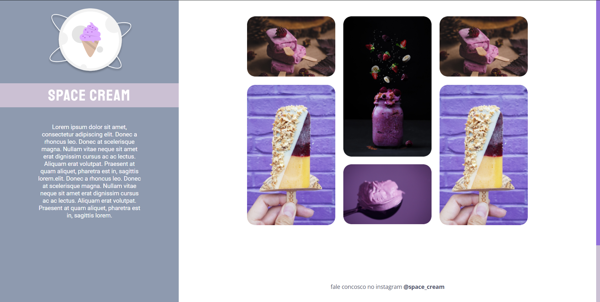

# Projeto 04

Projeto feito para recriar um site a partir de um layout do Figma, pra treinar conceitos de css (responsividade, grid e animações) vistos em uma aula da Rocketseat.

## Tecnologias
- HTML  
- CSS  
- Git

## Layout
Você pode visualizar os layouts do projeto através desses links:
 

[Mobile](<https://www.figma.com/file/drBBktNRdtCIUiN4cZk4yo/Stage-03---Mobile-First/duplicate>).
 

[Desktop](<https://www.figma.com/file/pddZCuQIRLjk5dEHQ4L4YR/Stage-03---Grid-com-anima%C3%A7%C3%B5es/duplicate>)
 

É necessário ter uma conta no [Figma](https://www.figma.com).
 

  

